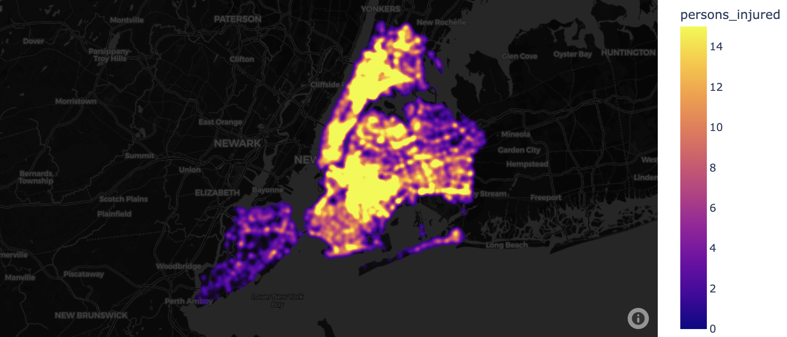
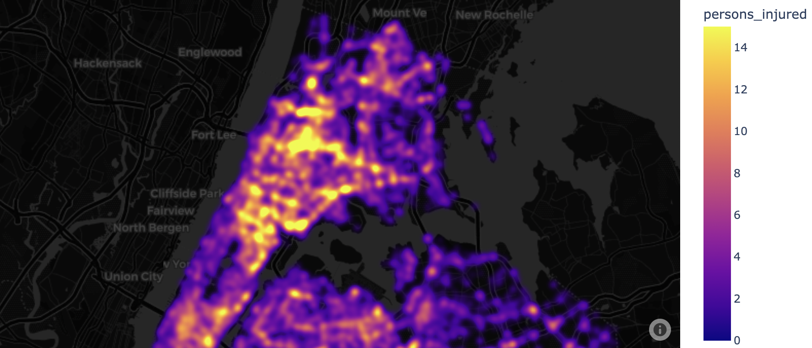
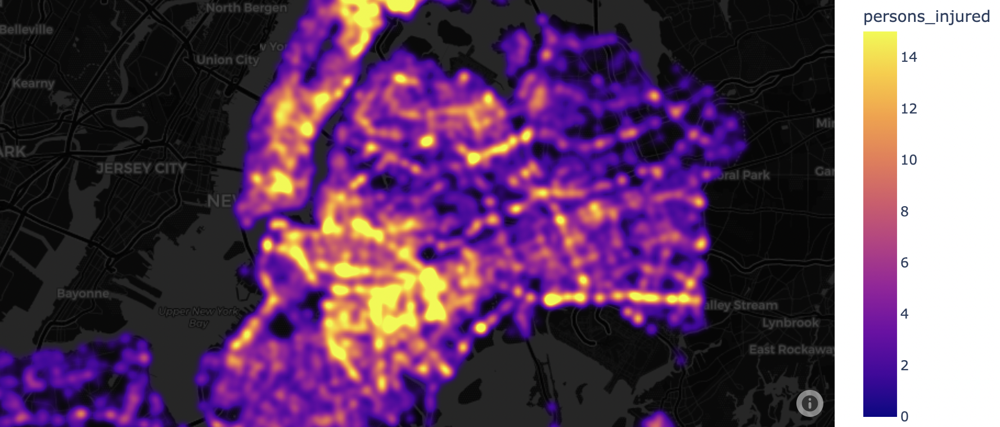
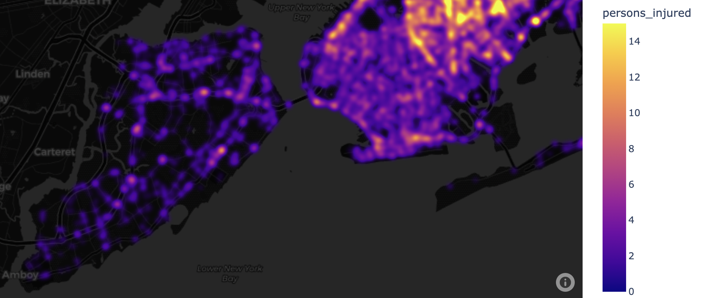

# Data cleaning project - NYC Trees

## Mission objectives

Clean properly a dataset for the Machine Learning process.

## Tools used

- Pandas
- Plotly for data visualization

## Database

We started with 28 columns and 100.000 rows
We finish with 52 columns and 91.792 entries

## Data visualization
We create a map in Plotly to see where crashes are happening in NYC.

## Cleaning
### Removing rows
- if 'location', 'latitude' and 'longitude' are all empty
- if 'latitude' or 'longitude' are out of NYC

### Removing columns that are redundant or not useful for ML
- 'location' 
- 'borough'
- 'on_street_name'
- 'off_street_name'
- 'cross_street_name'
- 'collision_id'

### To keep it simple, we remove columns related to the vehicle type

## New columns
Based on 'date_time', I create new useful information easier to process for the ML:
- 'hour'
- 'day_of_week' (Monday, ...)
- 'day'
- 'month'
- 'year'

## We One Hot Encode the columns related to the 'Contributing factors'
This creates a lot of new columns. We should try to flatten it to reduce the number of columns, but that would also result in a loss of data (which vehicle has which factor).